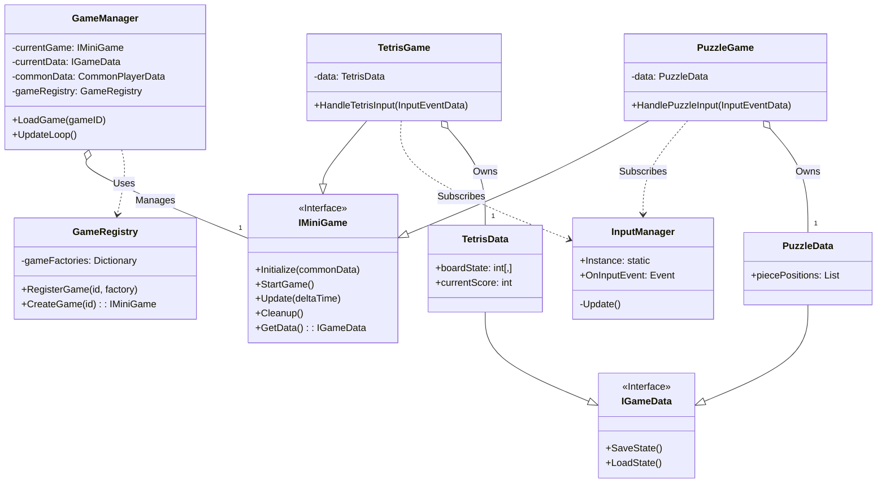

# PRD: 모듈형 미니게임 플랫폼 (v1.0)

- **문서명:** 모듈형 미니게임 플랫폼 제품 요구사항 정의서
- **작성자:** Senior Game Architect
- **작성일:** 2025-10-22
- **상태:** 초안 (Draft)

---

## 1. 프로젝트 개요 (Overview)

본 문서는 다양한 장르의 미니게임을 단일 앱 내에서 제공하는 **'모듈형 미니게임 플랫폼'**의 초기 구축을 위한 제품 요구사항을 정의합니다.

본 프로젝트의 핵심 기술 목표는, 초기 릴리스 이후 새로운 미니게임(퍼즐, 아케이드, 보드게임 등)이 추가될 때, 기존의 핵심 시스템을 **전혀 수정하지 않고도(OCP 원칙)** 게임을 '플러그인'처럼 쉽게 통합할 수 있는 견고하고 확장 가능한 기반 아키텍처를 구축하는 것입니다.

## 2. 프로젝트 목표 (Goals)

1. **궁극의 확장성 확보 (Technical Goal)**
   - 새로운 미니게임 로직과 데이터가 추가되어도 `GameManager`를 포함한 코어 시스템의 변경이 필요 없는 **개방-폐쇄 원칙(OCP)**을 준수하는 아키텍처를 확립합니다.
   - 모든 게임은 `IMiniGame` 인터페이스 규약을 따르도록 강제하여 시스템의 예측 가능성과 안정성을 보장합니다.

2. **통합 플레이어 경험 제공 (User Goal)**
   - 유저는 하나의 앱에서 다양한 미니게임을 중단 없이 선택하고 플레이할 수 있습니다.
   - 모든 미니게임은 플레이어 레벨, 재화 등 공통 데이터를 공유하여 일관된 보상 및 성장 경험을 제공합니다.

3. **중앙화된 데이터 및 입력 관리 (System Goal)**
   - `GameManager`가 모든 게임의 생명주기와 데이터 흐름을 총괄합니다.
   - `InputManager`가 모든 사용자 입력을 중앙에서 처리하고 이벤트 기반으로 각 게임에 분배하여, 게임 로직과 입력 처리를 명확히 분리합니다.

## 3. 핵심 아키텍처 (Project Structure)

본 프로젝트는 OCP와 SoC(관심사 분리) 원칙을 기반으로 다음과 같은 핵심 구조를 가집니다.

### 3.1. 코어 시스템 (Core Systems)

#### GameManager
- 플랫폼의 메인 컨트롤 타워입니다.
- `GameRegistry`를 통해 `IMiniGame` 인스턴스를 생성하고 생명주기(Load, Start, Update, Cleanup)를 관리합니다.
- `CommonPlayerData` (공용 데이터)를 소유하며, 현재 활성화된 게임의 `IGameData` (고유 데이터)를 참조합니다.

#### InputManager
- 모든 하드웨어 입력을 감지하는 싱글톤입니다.
- 감지된 입력을 `OnInputEvent`라는 중앙 이벤트를 통해 '방송'합니다.

#### GameRegistry
- 게임 ID(문자열)와 `IMiniGame` 생성 팩토리(Delegate/Func)를 매핑하는 '게임 등록소'입니다.
- **OCP의 핵심 장치**로, 새 게임 추가 시 이 클래스에 등록하는 코드 한 줄만 추가됩니다.

### 3.2. 게임 계약 (Interfaces)

#### IMiniGame (Interface)
모든 미니게임이 **반드시 구현**해야 하는 '플러그 규격'입니다.

**필수 메서드:**
- `Initialize(commonData)`: 공용 데이터 주입
- `StartGame()`: 게임 시작 및 InputManager 구독
- `Update()`: 매 프레임 게임 로직 실행
- `Cleanup()`: 게임 종료 및 InputManager 구독 해제
- `GetData()`: 게임 고유 데이터 반환

#### IGameData (Interface)
모든 미니게임의 고유 상태 데이터가 **반드시 구현**해야 하는 인터페이스입니다.

**선택적 메서드:**
- `SaveState()`: 데이터 저장
- `LoadState()`: 데이터 로드

### 3.3. 데이터 흐름 (Data Flow)

1. 유저가 "테트리스"를 선택합니다.
2. `GameManager`가 `gameRegistry.CreateGame("Tetris")`를 호출합니다.
3. `GameRegistry`는 등록된 팩토리를 실행하여 `TetrisGame` 인스턴스를 반환합니다.
4. `GameManager`가 `currentGame.Initialize(commonData)`를 호출합니다.
5. `GameManager`가 `this.currentGameData = currentGame.GetData()`를 호출합니다.
6. `GameManager`가 `currentGame.StartGame()`을 호출합니다.
7. `GameManager`는 매 프레임 `currentGame.Update()`를 호출합니다.

## 4. MVP 기능 범위 (MVP Scope)

MVP의 목표는 코어 아키텍처가 실제로 3개 이상의 서로 다른 게임을 완벽하게 지원할 수 있음을 증명하는 것입니다.

### 4.1. 코어 플랫폼 시스템

- [ ] `GameManager` 구현 (게임 로드, 업데이트 루프, 생명주기 관리)
- [ ] `InputManager` 구현 (이벤트 기반 입력 전파)
- [ ] `GameRegistry` 구현 (팩토리 기반 게임 등록 및 생성)
- [ ] `IMiniGame` 및 `IGameData` 인터페이스 정의
- [ ] `CommonPlayerData` 구조 정의 (예: `playerLevel: int`, `gold: int`)

### 4.2. MVP 미니게임 (3종)

#### 1. 테트리스 (Tetris)

**설명:** 고전적인 낙하 블록 퍼즐 게임.

**`IMiniGame` 구현:** `TetrisGame : IMiniGame`
- `HandleTetrisInput`: `InputManager`의 이벤트를 받아 블록을 좌/우/회전/소프트 드롭시킵니다.
- `Update`: 블록 자동 하강, 라인 완성 검사 및 제거 로직을 수행합니다.

**`IGameData` 구현:** `TetrisData : IGameData`
- `boardState: int[,]` (게임 보드판 상태)
- `currentPiece: Piece` (현재 블록 정보)
- `currentScore: int`
- `linesCleared: int`

#### 2. 스도쿠 (Sudoku)

**설명:** 9x9 그리드에 숫자를 채우는 논리 퍼즐.

**`IMiniGame` 구현:** `SudokuGame : IMiniGame`
- `HandleSudokuInput`: `InputManager`의 이벤트를 받아 셀 선택 및 숫자 입력을 처리합니다.
- `Update`: (선택 사항) 타이머 로직, 정답 실시간 검증 로직을 수행합니다.

**`IGameData` 구현:** `SudokuData : IGameData`
- `boardState: int[9, 9]` (유저가 채운 현재 보드 상태)
- `puzzleDefinition: int[9, 9]` (초기 문제)
- `selectedCell: Vector2Int`
- `playTime: float`

#### 3. 3x3 슬라이딩 퍼즐 (3x3 Sliding Puzzle)

**설명:** 8개의 타일을 움직여 이미지를 완성하는 퍼즐.

**`IMiniGame` 구현:** `SlidingPuzzleGame : IMiniGame`
- `HandleSlidingInput`: `InputManager`의 클릭/터치 이벤트를 받아 빈칸 주변의 타일을 이동시킵니다.
- `Update`: 퍼즐 완성 여부를 매 프레임 체크합니다.

**`IGameData` 구현:** `SlidingPuzzleData : IGameData`
- `tilePositions: int[3, 3]` (각 타일의 현재 위치, 0은 빈칸)
- `moveCount: int` (이동 횟수)
- `isCompleted: bool`

## 5. 핵심 아키텍처 클래스 다이어그램

## 6. 상세 시스템 명세

### 6.1. GameManager 상세

플랫폼의 모든 상태와 생명주기를 총괄하는 중앙 관제탑입니다.

**핵심 변수:**
- `private IMiniGame currentGame;` - 현재 활성화된 미니게임 인스턴스
- `private IGameData currentGameData;` - 현재 게임의 고유 데이터
- `private CommonPlayerData commonData;` - 모든 게임이 공유하는 공용 데이터
- `private GameRegistry gameRegistry;` - 게임 팩토리 레지스트리

**핵심 메서드:**

`public void LoadGame(string gameID)`
1. `currentGame`이 null이 아니면, `currentGame.Cleanup()`을 호출하여 기존 게임을 정리합니다.
2. `gameRegistry.CreateGame(gameID)`를 호출하여 새로운 게임 인스턴스를 가져옵니다.
3. `this.currentGame = newGame;`
4. `currentGame.Initialize(commonData)`를 호출하여 공용 데이터를 주입합니다.
5. `this.currentGameData = currentGame.GetData();`
6. `currentGame.StartGame()`을 호출하여 게임을 시작시킵니다.

`public void UpdateLoop(float deltaTime)`
- 플랫폼의 메인 루프에서 호출되며, `currentGame?.Update(deltaTime);`을 실행합니다.

### 6.2. InputManager 상세

모든 하드웨어 입력을 중앙에서 받아 처리하고, 이를 시스템 전반에 '방송'하는 싱글톤 클래스입니다.

**핵심 변수:**
- `public static InputManager Instance { get; }` - 싱글톤 인스턴스
- `public event Action<InputEventData> OnInputEvent;` - 입력 이벤트

**핵심 메서드:**

`private void Update()`
- 매 프레임 하드웨어 입력을 감지하고, `OnInputEvent?.Invoke(eventData);`를 호출합니다.

### 6.3. GameRegistry 상세

새로운 미니게임 클래스를 시스템에 '등록'하고 '생성'하는 책임을 집니다. **OCP를 만족시키는 핵심 장치**입니다.

**핵심 변수:**
- `private Dictionary<string, Func<IMiniGame>> gameFactories;` - 게임 ID와 팩토리 매핑

**핵심 메서드:**

`public void RegisterGame(string gameID, Func<IMiniGame> factory)`
- 앱 초기화 시점에 `RegisterGame("Tetris", () => new TetrisGame());`와 같이 호출되어 게임을 시스템에 등록합니다.

`public IMiniGame CreateGame(string gameID)`
- `GameManager`가 호출합니다. 딕셔너리에서 `gameID`에 맞는 팩토리를 찾아 실행하고, 생성된 인스턴스를 반환합니다.

## 7. 구현 예시

### 7.1. TetrisGame : IMiniGame

**핵심 변수:**
- `private TetrisData data;`
- `private CommonPlayerData commonDataRef;`

**메서드 구현:**
- `Initialize(CommonPlayerData commonData)`: `this.commonDataRef = commonData;` `this.data = new TetrisData();`
- `StartGame()`: `InputManager.Instance.OnInputEvent += HandleTetrisInput;`
- `Update(float deltaTime)`: 테트리스 블록 하강, 라인 체크 로직 수행
- `Cleanup()`: `InputManager.Instance.OnInputEvent -= HandleTetrisInput;`
- `GetData()`: `return this.data;`
- `private void HandleTetrisInput(InputEventData e)`: 입력 이벤트를 받아 `data.boardState`를 변경

### 7.2. TetrisData : IGameData

**핵심 변수:**
- `public int[,] boardState;` (테트리스 보드판)
- `public int currentScore;`
- `public Piece currentPiece;`

### 7.3. 새 게임 추가 시나리오 (OCP 검증)

만약 '스도쿠' 게임을 새로 추가한다면:

1. `SudokuGame : IMiniGame` 클래스를 새로 작성합니다.
2. `SudokuData : IGameData` 클래스를 새로 작성합니다.
3. 앱 초기화 로직에 `gameRegistry.RegisterGame("Sudoku", () => new SudokuGame());` **단 한 줄**만 추가합니다.

**코어 시스템은 전혀 수정되지 않습니다!** ✅ OCP 준수